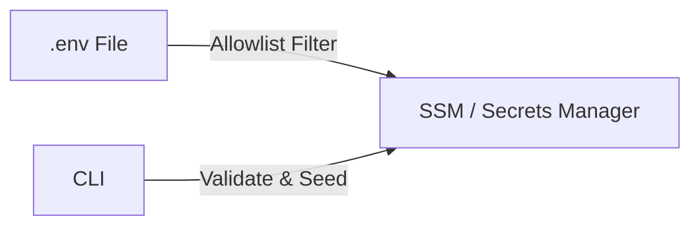
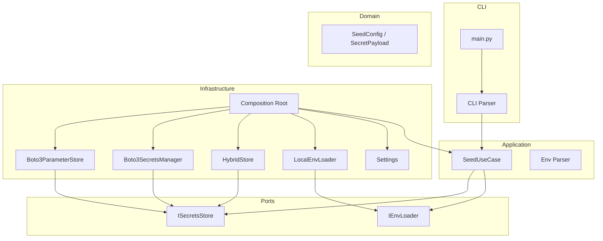

# Seed Secrets — Topos

Reads an allowlisted subset of keys from a `.env` file and upserts them as JSON blobs into AWS **SSM Parameter Store** (frontend config) and **Secrets Manager** (future backend secrets). Targets both **Floci/LocalStack** (`http://localhost:4566`) and **real AWS** (guarded by `--confirm-prod`).



## Quick Start

```bash
# 1. Install
poetry -C tools/seed-secrets install

# 2. Preview (dry-run, never writes)
make -C tools/seed-secrets dry-run

# 3. Seed to Floci
make -C tools/seed-secrets seed-floci
```

## What Gets Seeded

| Parameter / Secret Name | Keys | Service | Store |
|-------------|------|---------|-------|
| `/topos/frontend/config` | `VITE_ENV_TYPE`, `VITE_GRAPHQL_URL`, `VITE_BACKEND_URL`, `VITE_CLOUDINARY_CLOUD_NAME`, `VITE_CLOUDINARY_UPLOAD_PRESET`, `VITE_ENABLE_MOCKS`, `FRONTEND_CONTAINER`, `FRONTEND_INT_PORT`, `FRONTEND_EXT_PORT`, `APP_NETWORK`, `GATEWAY_*` | Frontend | SSM Parameter Store (String, JSON) |

Everything else (`DATABASE_URL`, `REDIS_URL`, `JWT_SECRET`, etc.) is ignored for now — backend secrets will be added as `topos/*` SM secrets gradually.

## CLI Usage

```bash
# Seed to Floci (SSM)
python main.py --env-file infrastructure/docker/prod/.env --endpoint-url http://localhost:4566

# Dry-run (preview, no writes)
python main.py --env-file infrastructure/docker/prod/.env --endpoint-url http://localhost:4566 --dry-run

# Real AWS (requires --confirm-prod)
python main.py --env-file infrastructure/docker/prod/.env --endpoint-url "" --region ap-south-1 --confirm-prod

# Seed only frontend
python main.py --env-file infrastructure/docker/prod/.env --endpoint-url http://localhost:4566 \
  --only /topos/frontend/config
```

| Argument | Default | Description |
|----------|---------|-------------|
| `--env-file` | `infrastructure/docker/prod/.env` | Path to dotenv file |
| `--endpoint-url` | `None` (real AWS) | `http://localhost:4566` for Floci |
| `--region` | `ap-south-1` | AWS region |
| `--dry-run` | `false` | Preview mode, no writes |
| `--only` | All secrets | Comma-separated secret/param name filter |
| `--force` | `false` | Allow overwriting Terraform-managed secrets |
| `--confirm-prod` | `false` | Required for real AWS writes |
| `--verbose` | `false` | Debug logging |

## Configuration

| Variable | Default | Description |
|----------|---------|-------------|
| `AWS_ENDPOINT_URL` | `None` (real AWS) | Floci: `http://localhost:4566` |
| `AWS_REGION` | `ap-south-1` | AWS region |
| `ENV_FILE` | `infrastructure/docker/prod/.env` | Dotenv file path |

## Safety Guards

| Guard | What It Prevents | Override |
|-------|------------------|----------|
| TF-managed secrets | Overwriting Terraform-owned secrets | `--force` |
| Real AWS writes | Accidental production changes | `--confirm-prod` |
| Unknown secrets | Typo in secret name | Use valid name |
| Error redaction | Secret values leaking in error messages | — |

## Architecture



```
src/
  core/             exceptions, constants, logging
  domain/           allowlists, secret names, schemas (pure Pydantic)
  interfaces/       ports: ISecretsStore, IEnvLoader
  application/      DTOs, env parser, use-case (orchestrates ports)
  infrastructure/   adapters: Boto3 SSM/SM, filesystem, config, wiring
  cli/              argparse parser
main.py             bootstrap: parse → settings → wire → load env → seed
```

## Development

```bash
make -C tools/seed-secrets lint       # ruff check
make -C tools/seed-secrets test       # unit tests (no network)
make -C tools/seed-secrets test-all   # unit + integration
make -C tools/seed-secrets test-cov   # unit + coverage (65% gate)
make -C tools/seed-secrets clean      # remove caches
```

## Verify

```bash
# List all SSM params in Floci
aws --endpoint-url http://localhost:4566 --region ap-south-1 \
  ssm describe-parameters --query 'Parameters[].Name'

# Check frontend param
aws --endpoint-url http://localhost:4566 --region ap-south-1 \
  ssm get-parameter --name /topos/frontend/config --query Parameter.Value

# List SM secrets (future backend)
aws --endpoint-url http://localhost:4566 --region ap-south-1 \
  secretsmanager list-secrets --query 'SecretList[].Name'
```

## Documentation

Detailed docs in [`docs/`](docs/):

| Doc | Description |
|-----|-------------|
| [Quick Start](docs/getting-started/quickstart.md) | Zero-to-running guide |
| [Configuration](docs/getting-started/configuration.md) | All settings and env vars |
| [Architecture](docs/concepts/architecture.md) | Clean architecture deep-dive |
| [Seeding Flow](docs/concepts/seeding-flow.md) | Step-by-step lifecycle |
| [CLI Reference](docs/components/cli.md) | All arguments and examples |
| [Validation & Guards](docs/components/validation.md) | Safety rules and allowlists |
| [Secrets Mapping](docs/components/secrets-mapping.md) | Which keys go to which param/secret |
| [Testing](docs/testing/overview.md) | How to run and write tests |
