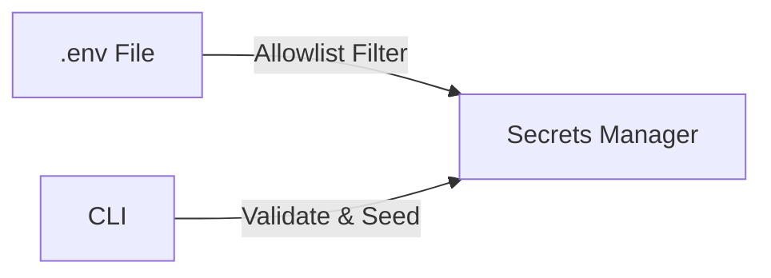
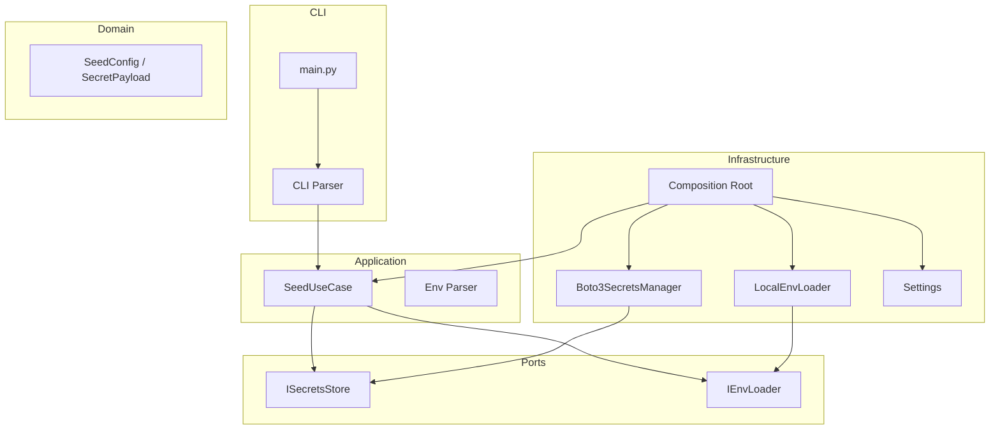

# Seed Secrets

Reads an allowlisted subset of keys from a `.env` file and upserts them as JSON blobs into AWS Secrets Manager. Targets both **Floci/LocalStack** (local development) and **real AWS** (production, guarded by `--confirm-prod`).



## Quick Start

```bash
# 1. Install
poetry -C tools/seed-secrets install

# 2. Preview (dry-run, never writes)
make -C tools/seed-secrets dry-run

# 3. Seed to Floci
make -C tools/seed-secrets seed-floci
```

## What Gets Seeded

| Secret Name | Keys | Service |
|-------------|------|---------|
| `detectai/web/secrets` | NEXTAUTH_SECRET, INTERNAL_API_KEY, GOOGLE_ID, GITHUB_ID, ... (11 keys) | Web App |
| `detectai/gateway/secrets` | PADDLE_WEBHOOK_SECRET, INTERNAL_API_KEY | Gateway |
| `detectai/workers/secrets` | PADDLE_API_KEY, PADDLE_ENVIRONMENT | Workers |
| `detectai/inference/secrets` | API_KEY, HF_TOKEN | Inference |
| `detectai/document-parser/secrets` | (empty by default) | Doc Parser |

Everything else (`DATABASE_URL`, `REDIS_URL`, `MONGO_URI`, etc.) is ignored.

## CLI Usage

```bash
# Seed to Floci
python main.py --env-file infra/docker/prod/.env --endpoint-url http://localhost:4566

# Dry-run (preview, no writes)
python main.py --env-file infra/docker/prod/.env --endpoint-url http://localhost:4566 --dry-run

# Real AWS (requires --confirm-prod)
python main.py --env-file infra/docker/prod/.env --endpoint-url "" --region ap-south-1 --confirm-prod

# Seed only specific secrets
python main.py --env-file infra/docker/prod/.env --endpoint-url http://localhost:4566 \
  --only detectai/web/secrets,detectai/gateway/secrets
```

| Argument | Default | Description |
|----------|---------|-------------|
| `--env-file` | `infra/docker/prod/.env` | Path to dotenv file |
| `--endpoint-url` | `None` (real AWS) | `http://localhost:4566` for Floci |
| `--region` | `ap-south-1` | AWS region |
| `--dry-run` | `false` | Preview mode, no writes |
| `--only` | All secrets | Comma-separated secret name filter |
| `--force` | `false` | Allow overwriting Terraform-managed secrets |
| `--confirm-prod` | `false` | Required for real AWS writes |
| `--verbose` | `false` | Debug logging |

## Configuration

| Variable | Default | Description |
|----------|---------|-------------|
| `AWS_ENDPOINT_URL` | `None` (real AWS) | Floci: `http://localhost:4566` |
| `AWS_REGION` | `ap-south-1` | AWS region |
| `ENV_FILE` | `infra/docker/prod/.env` | Dotenv file path |

## Safety Guards

The tool has built-in safety checks:

| Guard | What It Prevents | Override |
|-------|------------------|----------|
| TF-managed secrets | Overwriting Terraform-owned secrets | `--force` |
| Real AWS writes | Accidental production changes | `--confirm-prod` |
| Unknown secrets | Typo in secret name | Use valid name |
| Error redaction | Secret values leaking in error messages | — |

## Architecture

Clean architecture with strict dependency rules — domain never imports infrastructure.



```
src/
  core/             exceptions, constants, logging
  domain/           allowlists, secret names, schemas (pure Pydantic)
  interfaces/       ports: ISecretsStore, IEnvLoader
  application/      DTOs, env parser, use-case (orchestrates ports)
  infrastructure/   adapters: Boto3, filesystem, config, wiring
  cli/              argparse parser
main.py             bootstrap: parse → settings → wire → load env → seed
```

## Shared Key Sync

If shared keys are missing from `.env`, the tool generates them and writes the **same value** to every secret that needs them:

| Key | Synced Between |
|-----|----------------|
| `INTERNAL_API_KEY` | web, gateway |
| `AI_SERVICE_API_KEY` / `API_KEY` | web, inference (same value) |
| `NEXTAUTH_SECRET` | web only |

Generated keys are reported by name (never by value). Add them to `.env` for stability.

## Development

```bash
make -C tools/seed-secrets lint       # ruff check
make -C tools/seed-secrets test       # unit tests (no network)
make -C tools/seed-secrets test-all   # unit + integration
make -C tools/seed-secrets test-cov   # unit + coverage (65% gate)
make -C tools/seed-secrets clean      # remove caches
```

## CI

GitHub Actions workflow (`.github/workflows/tools-seed-secrets.yaml`) runs on `staging`/`main` (path-filtered): ruff lint + pytest with 65% coverage gate. Feature branches targeting `dev` paste local `make lint/test` output in PR.

## Verify

```bash
# List all secrets in Floci
aws --endpoint-url http://localhost:4566 --region ap-south-1 \
  secretsmanager list-secrets --query 'SecretList[].Name'

# Check a specific secret
aws --endpoint-url http://localhost:4566 --region ap-south-1 \
  secretsmanager get-secret-value --secret-id detectai/web/secrets --query SecretString
```

## Documentation

Detailed docs in [`docs/`](docs/):

| Doc | Description |
|-----|-------------|
| [Quick Start](docs/getting-started/quickstart.md) | Zero-to-running guide |
| [Configuration](docs/getting-started/configuration.md) | All settings and env vars |
| [Architecture](docs/concepts/architecture.md) | Clean architecture deep-dive |
| [Seeding Flow](docs/concepts/seeding-flow.md) | Step-by-step lifecycle |
| [CLI Reference](docs/components/cli.md) | All arguments and examples |
| [Validation & Guards](docs/components/validation.md) | Safety rules and allowlists |
| [Secrets Mapping](docs/components/secrets-mapping.md) | Which keys go to which secret |
| [Testing](docs/testing/overview.md) | How to run and write tests |
