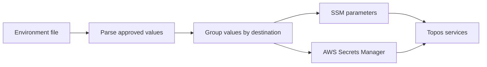

# Seed Secrets documentation

Seed Secrets is a small Python tool that takes approved keys from an environment
file and writes grouped JSON payloads to AWS Systems Manager Parameter Store
(SSM) or AWS Secrets Manager. It exists to make managed configuration repeatable
without copying every variable or printing secret values.

## Start here

1. [Quick start](getting-started/quickstart.md) — install the tool and safely preview a seed.
2. [Configuration](getting-started/configuration.md) — choose Floci or real AWS.
3. [Seeding flow](concepts/seeding-flow.md) — understand what is read and written.
4. [Architecture](concepts/architecture.md) — see the tool boundaries and safety point.
4. [Safety guards](components/safety-guards.md) — learn why a command may refuse to run.

## Documentation by task

| Task | Guide |
| --- | --- |
| Run or preview the tool | [Quick start](getting-started/quickstart.md) |
| Choose flags and commands | [CLI reference](components/cli.md) |
| Learn destinations and key groups | [Configuration mapping](components/configuration-mapping.md) |
| Fix a refused seed | [Safety guards](components/safety-guards.md) |
| Change or test the tool | [Testing](testing/overview.md) |

## What the tool does

The allowlist and destination mapping are code in
[`src/domain/constants.py`](../src/domain/constants.py). That file, rather than
this page, is the authoritative list of keys.
