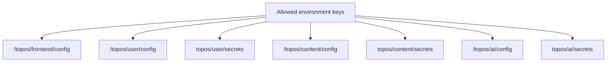

# Configuration mapping

The seeder writes one JSON payload per destination. It separates ordinary
configuration from private credentials.

| Destination | Type | Role |
| --- | --- | --- |
| `/topos/frontend/config` | SSM parameter | Public frontend build/runtime configuration. |
| `/topos/user/config` | SSM parameter | User-service non-secret configuration. |
| `topos/user/secrets` | Secrets Manager secret | User-service private values. |
| `/topos/content/config` | SSM parameter | Content-service non-secret configuration. |
| `topos/content/secrets` | Secrets Manager secret | Content-service private values. |
| `/topos/ai/config` | SSM parameter | AI-service non-secret configuration. |
| `topos/ai/secrets` | Secrets Manager secret | AI-service private values. |

The full key-to-destination map is intentionally maintained only in
[`src/domain/constants.py`](../../src/domain/constants.py). This avoids a
second, potentially stale copy in prose documentation.
