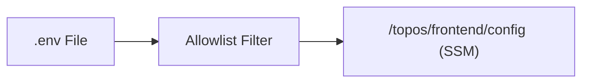

# Secrets Mapping — Topos

This document shows which environment keys go to which SSM parameter / secret.

## Overview

The tool reads an allowlisted set of keys from your `.env` file and groups them into JSON blobs, one per service. Frontend uses **SSM Parameter Store** (`/topos/frontend/config`), future backend will use **Secrets Manager** (`topos/*`).



## Parameter / Secret Names

| Name | Store | Service | Description |
|------|-------|---------|-------------|
| `/topos/frontend/config` | SSM Parameter Store (String, JSON) | Frontend | `VITE_*`, `FRONTEND_*`, `APP_NETWORK`, `GATEWAY_*` |

## Key Mapping

### `/topos/frontend/config` (SSM)

| Key | Type | Description |
|-----|------|-------------|
| `VITE_ENV_TYPE` | Env | `preview`, `dev`, `prod` |
| `VITE_GRAPHQL_URL` | URL | GraphQL endpoint (e.g., `https://your-domain.com/graphql`) |
| `VITE_BACKEND_URL` | URL | Backend base URL |
| `VITE_CLOUDINARY_CLOUD_NAME` | Cloudinary | Cloudinary cloud name (public, optional) |
| `VITE_CLOUDINARY_UPLOAD_PRESET` | Cloudinary | Upload preset (public, optional) |
| `VITE_ENABLE_MOCKS` | Flag | `true` to enable MSW mocks (ignored in `prod`) |
| `FRONTEND_CONTAINER` | Docker | Container name |
| `FRONTEND_INT_PORT` / `FRONTEND_EXT_PORT` | Docker | Container/host ports |
| `APP_NETWORK` | Docker | Docker network name |
| `GATEWAY_CONTAINER` / `GATEWAY_INT_PORT` / `GATEWAY_EXT_PORT` | Docker | Gateway container/ports |

**Total: 13 keys (empty values skipped)**

Future backend secrets (e.g., `topos/user/secrets`, `topos/ai/secrets`) will be added gradually and use Secrets Manager.

## Allowlist

Only keys in `SECRET_KEY_MAP` are ever read. Everything else (`DATABASE_URL`, `JWT_SECRET` for now, etc.) is ignored until added.

## Verification

```bash
aws --endpoint-url http://localhost:4566 --region ap-south-1 ssm get-parameter --name /topos/frontend/config --query Parameter.Value --output text | jq .
```
