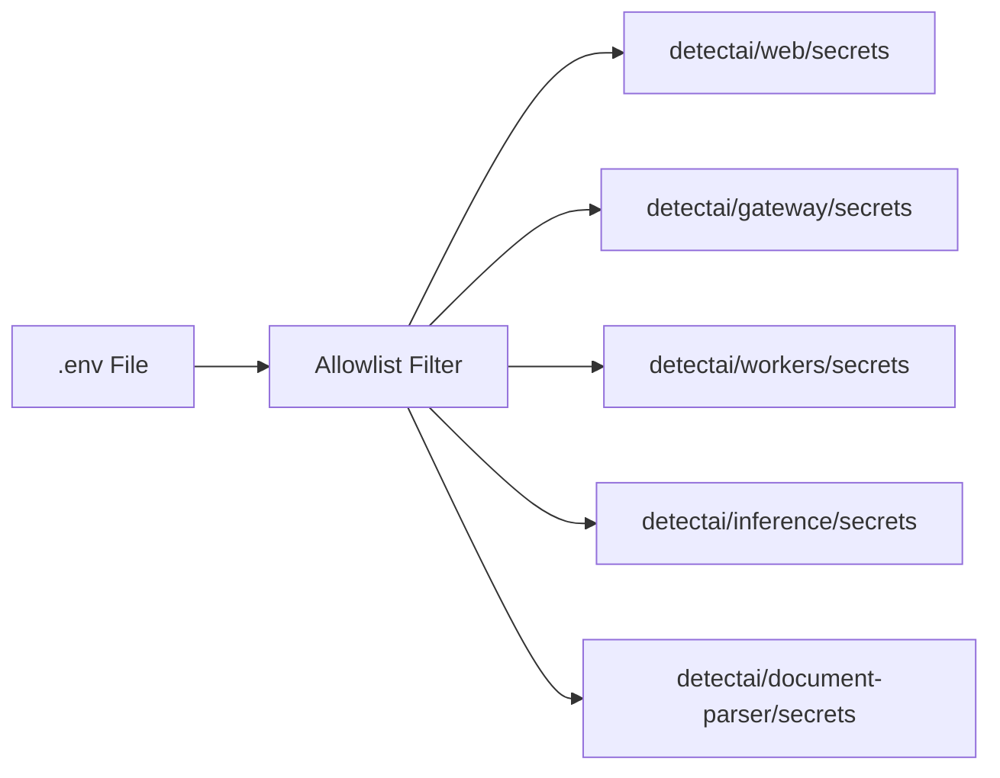
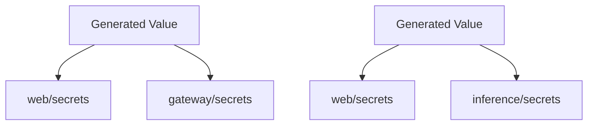

# Secrets Mapping

This document shows which environment keys go to which secret name in AWS Secrets Manager.

## Overview

The tool reads an allowlisted set of keys from your `.env` file and groups them into JSON blobs, one per service. Each blob is stored as a separate secret in AWS Secrets Manager.



## Secret Names

| Secret Name | Service | Description |
|-------------|---------|-------------|
| `detectai/web/secrets` | Next.js Web App | Auth, OAuth, API keys, Turnstile |
| `detectai/gateway/secrets` | API Gateway | Webhook secret, internal API key |
| `detectai/workers/secrets` | Background Workers | Paddle API key and environment |
| `detectai/inference/secrets` | AI Inference Service | API key, HuggingFace token |
| `detectai/document-parser/secrets` | Document Parser | (empty by default) |

## Key Mapping

### `detectai/web/secrets`

| Key | Type | Description |
|-----|------|-------------|
| `NEXTAUTH_SECRET` | Auth | NextAuth.js session encryption secret |
| `INTERNAL_API_KEY` | Auth | Internal service-to-service API key (synced with gateway) |
| `AI_SERVICE_API_KEY` | Auth | AI service API key (synced with inference) |
| `NEXT_PUBLIC_TURNSTILE_SITE_KEY` | Turnstile | Cloudflare Turnstile site key (public) |
| `TURNSTILE_SECRET_KEY` | Turnstile | Cloudflare Turnstile secret key |
| `NEXT_PUBLIC_PADDLE_CLIENT_TOKEN` | Paddle | Paddle client-side token (public) |
| `GOOGLE_ID` | OAuth | Google OAuth client ID |
| `GOOGLE_SECRET` | OAuth | Google OAuth client secret |
| `GITHUB_ID` | OAuth | GitHub OAuth client ID |
| `GITHUB_SECRET` | OAuth | GitHub OAuth client secret |
| `PROMETHEUS_WEB_SCRAPE_TOKEN` | Monitoring | Prometheus scrape authentication token |

**Total: 11 keys**

### `detectai/gateway/secrets`

| Key | Type | Description |
|-----|------|-------------|
| `PADDLE_WEBHOOK_SECRET` | Paddle | Paddle webhook signature verification secret |
| `INTERNAL_API_KEY` | Auth | Internal service-to-service API key (synced with web) |

**Total: 2 keys**

### `detectai/workers/secrets`

| Key | Type | Description |
|-----|------|-------------|
| `PADDLE_API_KEY` | Paddle | Paddle API key for server-side operations |
| `PADDLE_ENVIRONMENT` | Paddle | Paddle environment (`sandbox` or `production`) |

**Total: 2 keys**

**Default:** If `PADDLE_API_KEY` is present but `PADDLE_ENVIRONMENT` is missing, it defaults to `"sandbox"`.

### `detectai/inference/secrets`

| Key | Type | Description |
|-----|------|-------------|
| `API_KEY` | Auth | API key for inference service (synced with `AI_SERVICE_API_KEY`) |
| `HF_TOKEN` | HuggingFace | HuggingFace Hub token for model access |

**Total: 2 keys**

### `detectai/document-parser/secrets`

This secret is intentionally empty. It's only populated if you explicitly set keys that map to it.

**Total: 0 keys (by default)**

## Shared Key Synchronization

Some keys are shared across multiple secrets. The tool ensures they have the same value:



| Key | Shared Between | Sync Rule |
|-----|----------------|-----------|
| `INTERNAL_API_KEY` | web, gateway | Same value in both |
| `AI_SERVICE_API_KEY` | web | Same value as `API_KEY` |
| `API_KEY` | inference | Same value as `AI_SERVICE_API_KEY` |

### Sync Logic

1. If `INTERNAL_API_KEY` is in `.env` → use that value everywhere
2. If `INTERNAL_API_KEY` is missing → generate random 24-byte hex, write to both
3. If `AI_SERVICE_API_KEY` is in `.env` → use that value for `API_KEY` too
4. If `API_KEY` is in `.env` → use that value for `AI_SERVICE_API_KEY` too
5. If both are missing → generate random 24-byte hex, use for both

## Storage Format

Each secret is stored as compact JSON:

```json
{"NEXTAUTH_SECRET":"abc123...","INTERNAL_API_KEY":"def456...","GOOGLE_ID":"789.apps.googleusercontent.com"}
```

The JSON uses minimal formatting (`separators=(",",":")`) to reduce storage size.

## Terraform-Managed Secrets (Not Touched)

These secrets are managed by Terraform and are **never** modified by this tool without `--force`:

| Secret Name | Contains |
|-------------|----------|
| `detectai/pg/urls` | PostgreSQL connection strings |
| `detectai/pg/master` | PostgreSQL master credentials |
| `detectai/docdb/urls` | DocumentDB connection strings |
| `detectai/redis/chat/urls` | Redis chat cache connection |
| `detectai/redis/events/urls` | Redis events connection |
| `detectai/redis/users/urls` | Redis users connection |
| `detectai/mq/urls` | RabbitMQ connection strings |

## Verification

After seeding, verify with:

```bash
# List all secrets
aws --endpoint-url http://localhost:4566 --region ap-south-1 \
  secretsmanager list-secrets --query 'SecretList[].Name'

# Check a specific secret's keys
aws --endpoint-url http://localhost:4566 --region ap-south-1 \
  secretsmanager get-secret-value --secret-id detectai/web/secrets \
  --query SecretString | jq 'from_entries | keys'
```

## Related Documentation

- [Validation & Guards](validation.md) - Safety rules for modifying secrets
- [Seeding Flow](../concepts/seeding-flow.md) - How payloads are built
- [CLI Reference](cli.md) - Command-line options
- [Quick Start](../getting-started/quickstart.md) - Get up and running
