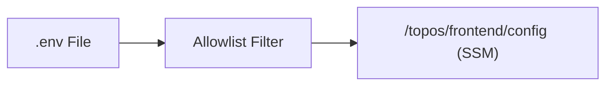

# Secrets Mapping — Topos

This document shows which environment keys go to which SSM parameter / secret.

## Overview

The tool reads an allowlisted set of keys from your `.env` file and groups them into JSON blobs, one per service. Frontend uses **SSM Parameter Store** (`/topos/frontend/config`), future backend will use **Secrets Manager** (`topos/*`).



## Parameter / Secret Names

| Name | Store | Service | Description |
|------|-------|---------|-------------|
| `/topos/frontend/config` | SSM Parameter Store (String, JSON) | Frontend | `VITE_*`, `FRONTEND_*`, `APP_NETWORK`, `GATEWAY_*` |

## Key Mapping

### `/topos/frontend/config` (SSM)

| Key | Type | Description |
|-----|------|-------------|
| `VITE_ENV_TYPE` | Env | `preview`, `dev`, `prod` |
| `VITE_GRAPHQL_URL` | URL | GraphQL endpoint (e.g., `https://your-domain.com/graphql`) |
| `VITE_BACKEND_URL` | URL | Backend base URL |
| `VITE_CLOUDINARY_CLOUD_NAME` | Cloudinary | Cloudinary cloud name (public, optional) |
| `VITE_CLOUDINARY_UPLOAD_PRESET` | Cloudinary | Upload preset (public, optional) |
| `VITE_ENABLE_MOCKS` | Flag | `true` to enable MSW mocks (ignored in `prod`) |
| `FRONTEND_CONTAINER` | Docker | Container name |
| `FRONTEND_INT_PORT` / `FRONTEND_EXT_PORT` | Docker | Container/host ports |
| `APP_NETWORK` | Docker | Docker network name |
| `GATEWAY_CONTAINER` / `GATEWAY_INT_PORT` / `GATEWAY_EXT_PORT` | Docker | Gateway container/ports |

**Total: 13 keys (empty values skipped)**

## Backend secrets

### `topos/user/secrets` (SM)

| Key | Description |
|-----|-------------|
| `DATABASE_URL` | Pooled app URL. Prod: RDS Proxy endpoint + `?sslmode=require`. Never a pooler flag — `@prisma/adapter-pg` issues unnamed statements, which don't pin proxy sessions. |
| `DATABASE_URL_MIGRATE` | Direct writer URL for `prisma migrate deploy` + `user-migrator`. Prod: writer endpoint + `?sslmode=require`, never through the proxy (DDL/advisory locks pin or break on a pooler). |
| `AI_CHECKPOINTER_PASSWORD` | AI role password, consumed by the `user-migrator` entrypoint to bootstrap the `ai_checkpointer` role + `ai_checkpoints` database on every deploy (local alias `AI_POSTGRES_PASSWORD`). |
| `REDIS_URL` | Redis URL |
| `JWT_SECRET` | JWT signing secret |

### `/topos/user/config` (SSM)

App-pool tuning (no secret rotation needed): `PG_POOL_MAX` (default `10`),
`PG_POOL_IDLE_TIMEOUT_MS` (default `30000`), `PG_POOL_CONNECTION_TIMEOUT_MS`
(default `5000`). Bounds keep `tasks × pool_max` within the proxy budget on a
micro instance; timeouts stay well under the proxy borrow timeout (120s).

Local aliases: `USER_DATABASE_URL`, `USER_DATABASE_URL_MIGRATE`,
`USER_PG_POOL_MAX`, `USER_PG_POOL_IDLE_TIMEOUT_MS`,
`USER_PG_POOL_CONNECTION_TIMEOUT_MS`.

### `topos/ai/secrets` (SM)

| Key | Description |
|-----|-------------|
| `CHECKPOINT_DB_URL` | Pooled runtime URL for the LangGraph checkpoint pool. Prod: proxy endpoint, `ai_checkpoints` DB + `?sslmode=require`. |
| `CHECKPOINT_DB_URL_MIGRATE` | Direct writer URL used only for `saver.setup()` DDL. Prod: writer endpoint, never the proxy. Empty falls back to `CHECKPOINT_DB_URL` (local/dev). |
| `LLM_API_URL`, `LLM_API_KEY`, `LANGCHAIN_API_KEY`, `QDRANT_URL`, `QDRANT_API_KEY`, `EMBEDDING_URL`, `CONTENT_SERVICE_URL`, `CONTENT_INTERNAL_TOKEN` | As before |

### `/topos/ai/config` (SSM)

Adds `CHECKPOINT_POOL_MIN_SIZE` (default `1`) and `CHECKPOINT_POOL_MAX_SIZE`
(default `10`) alongside the existing `CHECKPOINT_STARTUP_RETRIES`.

Local aliases: `AI_CHECKPOINT_DB_URL`, `AI_CHECKPOINT_DB_URL_MIGRATE`,
`AI_CHECKPOINT_POOL_MIN_SIZE`, `AI_CHECKPOINT_POOL_MAX_SIZE`.

Future backend secrets (e.g., `topos/user/secrets`, `topos/ai/secrets`) will be added gradually and use Secrets Manager.

## Allowlist

Only keys in `SECRET_KEY_MAP` are ever read. Everything else (`DATABASE_URL`, `JWT_SECRET` for now, etc.) is ignored until added.

## Verification

```bash
aws --endpoint-url http://localhost:4566 --region ap-south-1 ssm get-parameter --name /topos/frontend/config --query Parameter.Value --output text | jq .
```
