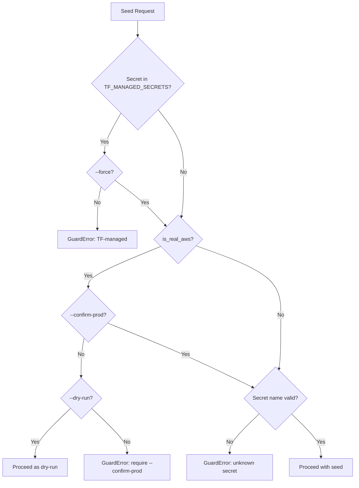

# Validation & Guards

This document explains all safety guards, allowlist rules, and validation behavior in the Seed Secrets tool.

## Safety Guards

The tool has three safety guards that prevent accidental or dangerous operations. Guards raise `GuardError` and exit with code `2`.

### Guard #1: Terraform-Managed Secrets

The tool refuses to touch secrets owned by Terraform without explicit override.

| Secret Name | Owner |
|-------------|-------|
| `detectai/pg/urls` | Terraform |
| `detectai/pg/master` | Terraform |
| `detectai/docdb/urls` | Terraform |
| `detectai/redis/chat/urls` | Terraform |
| `detectai/redis/events/urls` | Terraform |
| `detectai/redis/users/urls` | Terraform |
| `detectai/mq/urls` | Terraform |

**When it triggers:**
- You use `--only detectai/pg/urls` without `--force`
- The `.env` file contains keys that map to a TF-managed secret

**How to fix:**
- Use `--force` to override (only if you know what you're doing)
- Remove the TF-managed secret name from `--only`

**Error message:**
```
ERROR: refusing to touch TF-managed secret detectai/pg/urls without --force
```

### Guard #2: Real AWS Writes

The tool refuses to write to real AWS (not Floci/LocalStack) without confirmation.

**When it triggers:**
- `endpoint_url` is `None` (real AWS)
- `--dry-run` is not set
- `--confirm-prod` is not set

**How to fix:**
- Add `--confirm-prod` to confirm the write
- Use `--dry-run` to preview without writing

**Error message:**
```
ERROR: refusing to write to real AWS without --confirm-prod (or use --dry-run to preview)
```

### Guard #3: Unknown Secret Names

The tool validates that `--only` values are known secret names.

**When it triggers:**
- You use `--only detectai/unknown/secrets`

**How to fix:**
- Use a valid secret name from `APP_SECRETS` or `TF_MANAGED_SECRETS`
- Check the [Secrets Mapping](secrets-mapping.md) for valid names

**Error message:**
```
ERROR: unknown secret detectai/unknown/secrets
```

## Guard Flow Diagram



## Allowlist Filtering

Only keys in the allowlist are read from the `.env` file. Everything else is ignored.

### What's Allowlisted

| Category | Keys |
|----------|------|
| Auth | `NEXTAUTH_SECRET`, `GOOGLE_ID`, `GOOGLE_SECRET`, `GITHUB_ID`, `GITHUB_SECRET` |
| API Keys | `INTERNAL_API_KEY`, `AI_SERVICE_API_KEY`, `API_KEY`, `HF_TOKEN` |
| Paddle | `PADDLE_API_KEY`, `PADDLE_ENVIRONMENT`, `PADDLE_WEBHOOK_SECRET`, `NEXT_PUBLIC_PADDLE_CLIENT_TOKEN` |
| Turnstile | `NEXT_PUBLIC_TURNSTILE_SITE_KEY`, `TURNSTILE_SECRET_KEY` |
| Monitoring | `PROMETHEUS_WEB_SCRAPE_TOKEN` |

### What's NOT Allowlisted (Ignored)

| Key | Why Ignored |
|-----|-------------|
| `DATABASE_URL` | Managed by Terraform |
| `REDIS_URL` | Managed by Terraform |
| `MONGO_URI` | Managed by Terraform |
| `REDIS_PASSWORD` | Managed by Terraform |
| `CHATS_MONGO_URI` | Managed by Terraform |
| Any key not in `SECRET_KEY_MAP` | Not part of app secrets |

## Value Rules

| Rule | Description |
|------|-------------|
| Empty values skipped | `KEY=` or `KEY=""` is not seeded |
| Whitespace stripped | Leading/trailing whitespace is removed |
| Null bytes rejected | Paths with `\x00` are rejected |
| No value printing | Secret values are never printed; only key names are shown |

## Shared Key Sync Rules

When shared keys are missing, the tool generates and syncs them:

| Key | Generated? | Synced To | Rule |
|-----|------------|-----------|------|
| `INTERNAL_API_KEY` | Yes (24 bytes hex) | web, gateway | Same value in both |
| `AI_SERVICE_API_KEY` | Yes (24 bytes hex) | web, inference | Same value as `API_KEY` |
| `API_KEY` | Yes (24 bytes hex) | web, inference | Same value as `AI_SERVICE_API_KEY` |
| `NEXTAUTH_SECRET` | Yes (32 bytes hex) | web | Not synced elsewhere |
| `PADDLE_ENVIRONMENT` | No (default `"sandbox"`) | workers | Only if `PADDLE_API_KEY` is present |

**Fallback rule:** If `API_KEY` is missing but `AI_SERVICE_API_KEY` exists, the existing value is used for both. If both are missing, one value is generated and synced.

## Error Redaction

AWS error messages are redacted if they contain sensitive material:

| Contains | Result |
|----------|--------|
| `token` (case-insensitive) | Fully redacted |
| `secretstring` (case-insensitive) | Fully redacted |
| `bearer` (case-insensitive) | Fully redacted |
| Nothing sensitive | Message passed through |

**Example:**
```
Original: "Token hf_abc123 is invalid for secret detectai/web/secrets"
Redacted: "Secrets Manager error (redacted — contains secret material)"
```

## Error Messages and Fixes

| Error Message | Cause | Fix |
|---------------|-------|-----|
| `refusing to touch TF-managed secret <name> without --force` | Trying to seed a TF-owned secret | Use `--force` or remove from `--only` |
| `refusing to write to real AWS without --confirm-prod` | Real AWS without safety flag | Add `--confirm-prod` or use `--dry-run` |
| `unknown secret <name>` | Invalid `--only` value | Use a valid secret name |
| `env_file must be non-empty` | Empty `--env-file` | Set a valid file path |
| `env_file contains null byte` | Path has `\x00` | Use a clean path |
| `failed to upsert <name>: ...` | AWS write failed | Check credentials, network, permissions |
| `Environment file not found` | `.env` file doesn't exist | Check `--env-file` path |

## Related Documentation

- [Secrets Mapping](secrets-mapping.md) - Full list of secret names and their keys
- [CLI Reference](cli.md) - All command-line arguments
- [Seeding Flow](../concepts/seeding-flow.md) - How guards are checked during execution
- [Configuration](../getting-started/configuration.md) - Settings and endpoints
