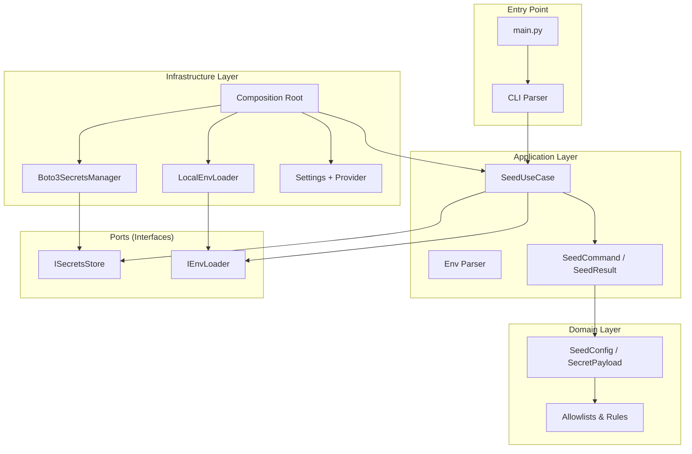

# Architecture

This document explains how the Seed Secrets tool is structured and why it's designed this way.

## Overview

The Seed Secrets tool is a **one-shot CLI tool** (not a running service). It reads a `.env` file, filters to allowlisted keys, and upserts them into AWS Secrets Manager. It follows **clean architecture** (hexagonal architecture):

- **Business logic** is in the center
- **External systems** (AWS Secrets Manager, filesystem) connect through **ports** (interfaces)
- Each external system has an **adapter** that implements the port



**Why this pattern?**
- **Testable** — Business logic can be tested with fake implementations (no real AWS, no real filesystem)
- **Swappable** — Want to seed to a different provider? Implement `ISecretsStore` for it
- **No I/O in domain** — The domain layer never touches AWS or the filesystem

## Project Structure

```
tools/seed-secrets/
├── main.py                          # Thin bootstrap — parse args, wire, run
├── src/
│   ├── core/                        # Shared utilities (no domain imports)
│   │   ├── constants.py             #   Exit codes (USAGE=2, RUNTIME=1)
│   │   ├── exceptions.py            #   Exception hierarchy (5 classes)
│   │   └── logging.py               #   Logging setup, redact() for secrets
│   │
│   ├── domain/                      # Pure business rules (no I/O)
│   │   ├── constants.py             #   Allowlists, secret names, shared keys
│   │   └── schemas.py               #   SeedConfig, SecretPayload (Pydantic)
│   │
│   ├── interfaces/                  # Ports — abstract contracts
│   │   ├── secrets_store.py         #   ISecretsStore (upsert, list)
│   │   └── env_loader.py            #   IEnvLoader (load, resolve_path)
│   │
│   ├── application/                 # Use cases — orchestrate ports
│   │   ├── dto.py                   #   SeedCommand, SeedResult
│   │   ├── env_parser.py            #   Pure dotenv parser (no FS I/O)
│   │   ├── use_cases.py             #   SeedUseCase (core logic)
│   │   └── seeder.py                #   Deprecated shim (legacy)
│   │
│   └── infrastructure/              # Adapters — real implementations
│       ├── config/
│       │   ├── settings.py          #   Pydantic Settings
│       │   └── provider.py          #   Cached settings loader
│       ├── filesystem/
│       │   └── env_loader.py        #   LocalEnvLoader (FS reads)
│       ├── secrets_manager.py       #   Boto3SecretsManager (AWS)
│       └── composition/
│           └── container.py         #   build_seeder() — sole wiring
│
├── tests/
│   ├── unit/                        # Fast, no network
│   │   ├── test_schemas.py
│   │   ├── test_seed_use_case.py
│   │   ├── test_config_provider.py
│   │   └── test_cli_parser.py
│   ├── integration/                 # Mocked AWS, real filesystem
│   │   ├── test_composition_integration.py
│   │   ├── test_secrets_adapter_integration.py
│   │   └── test_loader_integration.py
│   ├── test_seeder.py               # Legacy tests
│   └── test_env_parser.py           # Parser tests
│
├── Makefile                         # Common commands
├── pyproject.toml                   # Poetry config, pytest, ruff, coverage
├── .env.example                     # Environment template
└── docs/                            # This documentation
```

## Dependency Rule

Dependencies flow **inward only**:

```
domain <- application <- infrastructure
main -> composition -> all
```

- **Domain** never imports from infrastructure, application, or core
- **Application** imports from domain (schemas, constants) and interfaces (ports)
- **Infrastructure** imports from domain and interfaces, and implements adapters
- **main.py** only imports from composition (the wiring layer)

This means the domain layer is completely pure — no filesystem access, no AWS calls, no framework dependencies beyond Pydantic.

## Layers Explained

### Core (`src/core/`)

Shared utilities used across all layers. No domain or infrastructure imports.

| File | Purpose |
|------|---------|
| `constants.py` | Exit codes (`EXIT_CODE_USAGE=2`, `EXIT_CODE_RUNTIME=1`) |
| `exceptions.py` | Single exception hierarchy rooted at `SeedException` |
| `logging.py` | `configure_logging()`, `redact()` to mask secret values |

### Domain (`src/domain/`)

Pure business rules and data structures. No I/O.

| File | Purpose |
|------|---------|
| `constants.py` | Allowlists, secret names, shared key definitions |
| `schemas.py` | `SeedConfig` (immutable config), `SecretPayload` (name + data dict) |

### Interfaces (`src/interfaces/`)

Abstract contracts (ports) that define what the application needs from the outside world.

| Interface | Methods | Purpose |
|-----------|---------|---------|
| `ISecretsStore` | `upsert()`, `list_secrets()` | Write to a secrets backend |
| `IEnvLoader` | `load()`, `resolve_path()` | Read dotenv files |

### Application (`src/application/`)

Use cases and pure utilities.

| File | Purpose |
|------|---------|
| `dto.py` | `SeedCommand` (alias), `SeedResult` (results + generated keys) |
| `env_parser.py` | Pure dotenv parser (handles `export`, quotes, inline comments) |
| `use_cases.py` | `SeedUseCase` — orchestrates payload building and guarded writes |

The use case:
1. Validates guards (TF-managed, real AWS)
2. Builds payloads from the env dict (filters to allowlist, generates shared keys)
3. For each payload: dry-run → skip, or `store.upsert()` → record result
4. Returns results and list of generated keys

### Infrastructure (`src/infrastructure/`)

Real implementations of the ports.

| Component | Implementation | Purpose |
|-----------|----------------|---------|
| `config/` | `Settings` + `get_settings()` | Load and validate configuration |
| `filesystem/` | `LocalEnvLoader` | Read `.env` files from disk |
| `secrets_manager.py` | `Boto3SecretsManager` | Upsert to AWS Secrets Manager |
| `composition/` | `build_seeder()` | Wire everything together |

### Composition Root (`src/infrastructure/composition/container.py`)

This is the **only place** that knows about all concrete implementations. It:

1. Creates a `Boto3SecretsManager` (implements `ISecretsStore`)
2. Creates a `LocalEnvLoader` (implements `IEnvLoader`)
3. Injects both into `SeedUseCase`

Every other file only knows about interfaces, never concrete classes.

## Data Model

### SeedConfig (Input)

| Field | Type | Default | Description |
|-------|------|---------|-------------|
| `env_file` | string | `infrastructure/docker/prod/.env` | Path to dotenv file |
| `endpoint_url` | string \| None | `None` | AWS endpoint (None = real AWS) |
| `region` | string | `ap-south-1` | AWS region |
| `dry_run` | bool | `false` | Preview mode |
| `only` | frozenset \| None | `None` | Filter to specific secret names |
| `force` | bool | `false` | Allow TF-managed overwrites |
| `confirm_prod` | bool | `false` | Safety flag for real AWS |

**Property:** `is_real_aws` — `True` when `endpoint_url` is `None`

### SecretPayload (Domain)

| Field | Type | Description |
|-------|------|-------------|
| `name` | string | Secret name (e.g., `/topos/frontend/config`) |
| `data` | dict[str, str] | Key-value pairs stored as JSON |

### SeedResult (Output)

| Field | Type | Description |
|-------|------|-------------|
| `results` | list[tuple[str, str]] | List of (secret_name, status) pairs |
| `generated` | list[str] | Names of keys that were auto-generated |
| `config` | SeedConfig | The config used |

## Exception Hierarchy

```
SeedException (base)
├── ConfigError              — invalid/missing config
├── EnvParseError(path=)     — dotenv file parse failures
├── SecretsWriteError(secret_name=) — AWS write failures
└── GuardError               — safety guard blocked operation
```

## Why This Design?

| Benefit | Explanation |
|---------|-------------|
| **Testability** | Use case tests use `FakeStore` and deterministic `key_gen` — no AWS, no filesystem |
| **Swappability** | Want to seed to Vault? Implement `ISecretsStore` for it |
| **No I/O in domain** | Domain validates format and rules, not filesystem existence or AWS state |
| **Single wiring point** | `container.py` is the only place that imports concrete implementations |
| **Safety by default** | Guards prevent accidental writes to TF-managed or production secrets |

## Legacy Code

`src/application/seeder.py` contains a deprecated alias `Seeder = SeedUseCase`. It's kept for backward compatibility. New code should use `SeedUseCase` directly and `build_seeder()` from the composition root.

## Next Steps

- [Seeding Flow](seeding-flow.md) - See what happens step-by-step when you seed
- [Configuration](../getting-started/configuration.md) - Learn about settings
- [Secrets Mapping](../components/secrets-mapping.md) - Which keys go where
- [Testing Overview](../testing/overview.md) - How the architecture enables testing
