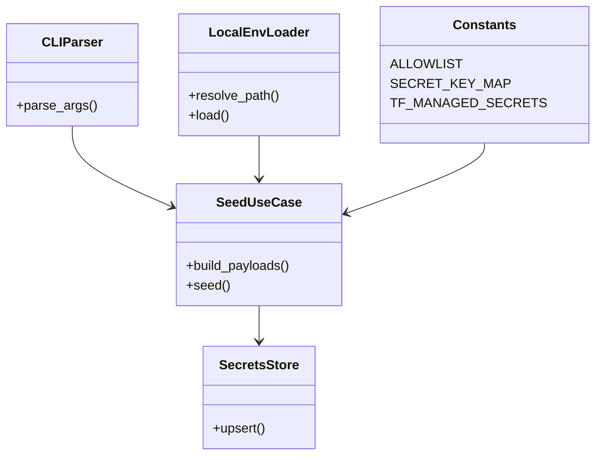

# Seed Secrets architecture

The tool keeps CLI parsing, file loading, payload construction, safety checks,
and AWS writes as separate responsibilities. That makes the dangerous boundary
—the write to managed configuration—small and testable.

```mermaid
classDiagram
    class CLIParser {
        +parse_args()
    }
    class LocalEnvLoader {
        +resolve_path()
        +load()
    }
    class SeedUseCase {
        +build_payloads()
        +seed()
    }
    class SecretsStore {
        +upsert()
    }
    class Constants {
        ALLOWLIST
        SECRET_KEY_MAP
        TF_MANAGED_SECRETS
    }

    CLIParser --> SeedUseCase
    LocalEnvLoader --> SeedUseCase
    Constants --> SeedUseCase
    SeedUseCase --> SecretsStore
```

The concrete boundaries live in `src/cli/`, `src/infrastructure/filesystem/`,
`src/application/`, and `src/infrastructure/`. The constants file is the single
source for key mapping and guard lists.
