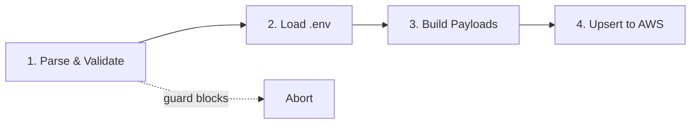
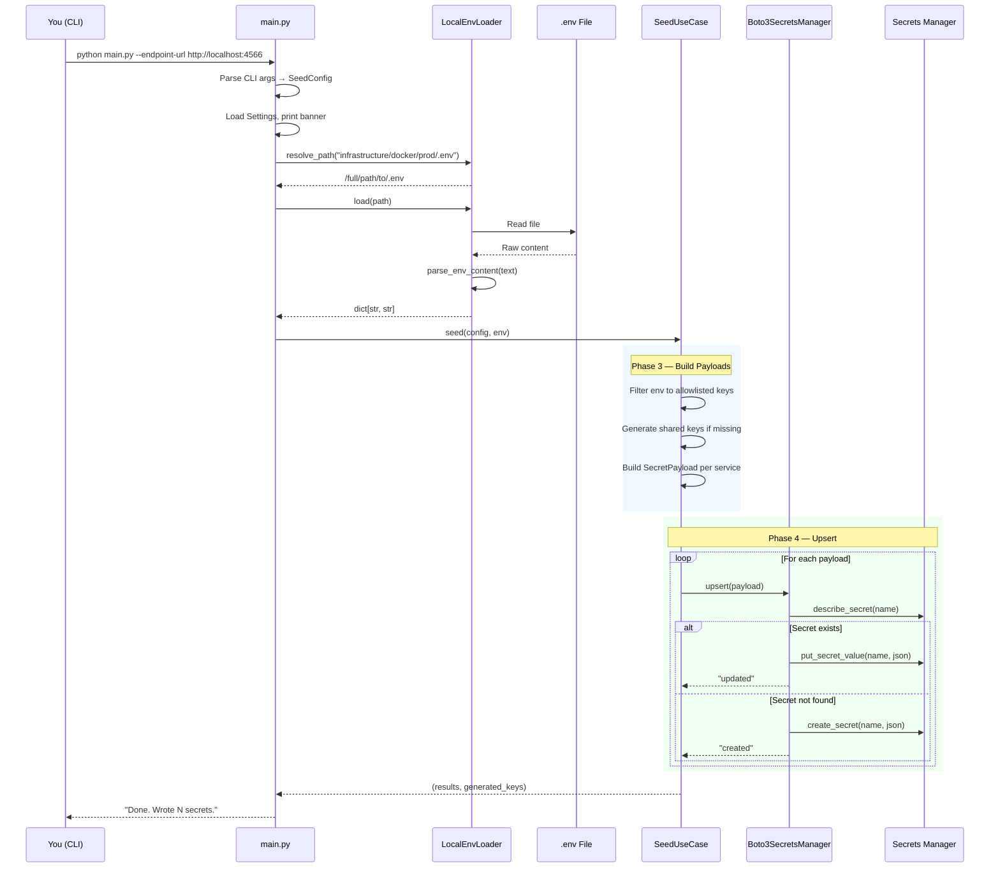
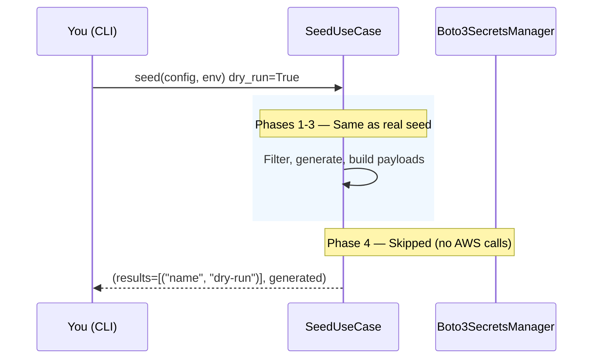
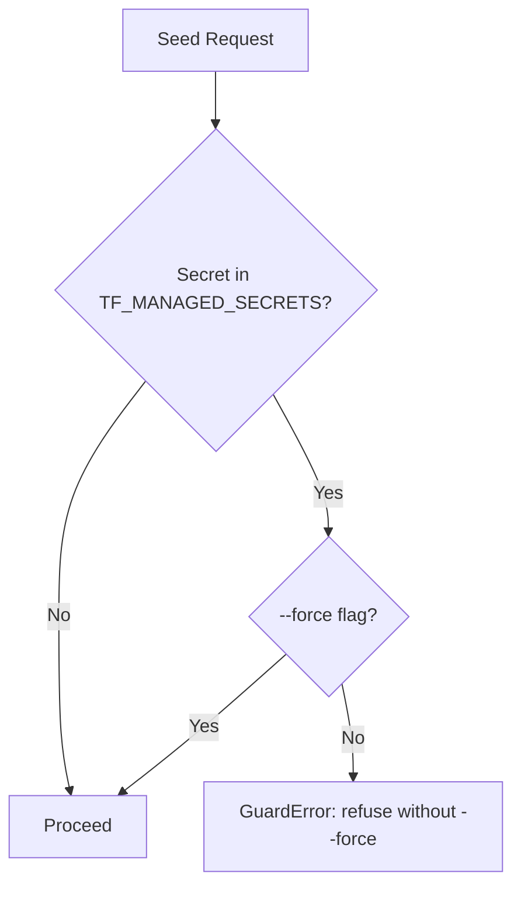
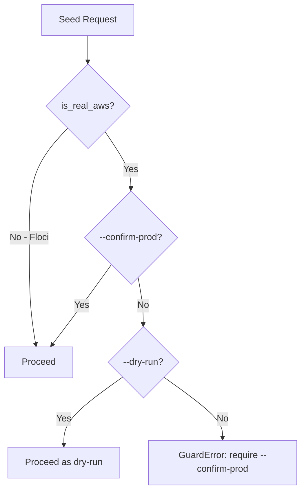
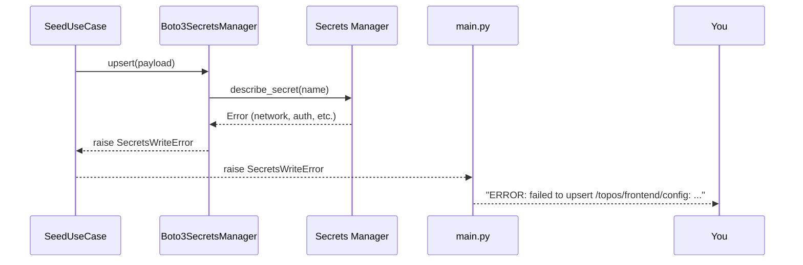
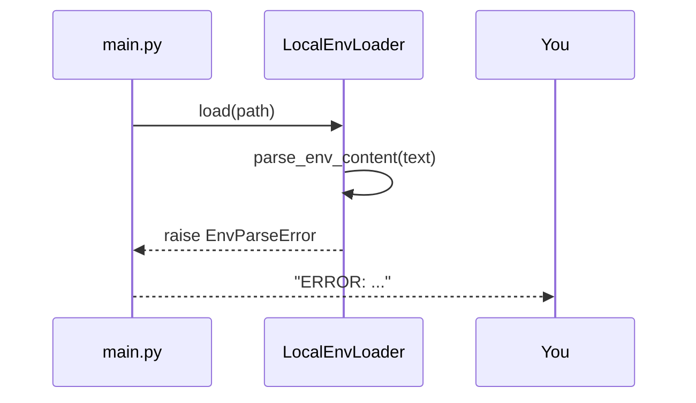

# Seeding Flow

This document explains what happens step-by-step when you run the seed command. We'll trace through a Floci seed, a real AWS seed, and dry-run mode.

## Overview

Seeding has four phases:



1. **Parse & Validate** — Parse CLI args, load settings, check guards
2. **Load .env** — Read and parse the dotenv file
3. **Build Payloads** — Filter to allowlisted keys, generate shared keys, build JSON blobs
4. **Upsert to AWS** — For each payload: create or update in Secrets Manager

## Full Seed Flow (Floci)

Here's the complete sequence for seeding to Floci/LocalStack:



### What happens at each step:

1. **Parse CLI args** — `main.py` reads `--endpoint-url`, `--env-file`, `--dry-run`, etc.
2. **Load settings** — Settings provider reads from environment + `.env`
3. **Resolve env path** — `LocalEnvLoader` finds the `.env` file (tries raw path, then relative to repo root)
4. **Parse dotenv** — Pure parser handles `export`, quotes, inline comments, empty values
5. **Filter to allowlist** — Only known keys are kept; `DATABASE_URL`, `REDIS_URL`, etc. are ignored
6. **Generate shared keys** — If `INTERNAL_API_KEY` or `AI_SERVICE_API_KEY` are missing, random values are generated
7. **Build payloads** — One `SecretPayload` per service, containing only the keys that service needs
8. **Upsert** — For each payload: check if it exists, then create or update

## Dry-Run Flow

Dry-run does everything except the actual AWS writes:



**What's done in dry-run:**
- `.env` file is read and parsed
- Keys are filtered to allowlist
- Shared keys are generated (in memory only)
- Payloads are built

**What's NOT done:**
- No AWS API calls
- No secrets created or updated
- Generated keys are shown by name (never by value)

## Guard Paths

### TF-Managed Guard

The tool refuses to touch Terraform-managed secrets without `--force`:



### Real AWS Guard

The tool refuses to write to real AWS without `--confirm-prod`:



## Shared Key Generation

When shared keys are missing from `.env`, the tool generates them:

| Key | Bytes | Hex Length | Synced To |
|-----|-------|------------|-----------|
| `INTERNAL_API_KEY` | 24 | 48 chars | web, gateway |
| `AI_SERVICE_API_KEY` / `API_KEY` | 24 | 48 chars | web, inference (same value) |
| `NEXTAUTH_SECRET` | 32 | 64 chars | web only |

**Sync logic:**
- If `INTERNAL_API_KEY` is missing → generate once, write to web and gateway
- If `AI_SERVICE_API_KEY` is missing → generate once, write to both `AI_SERVICE_API_KEY` and `API_KEY` (same value)
- If `NEXTAUTH_SECRET` is missing → generate once, write to web

Generated keys are reported by name only:

```
Generated 3 keys (not in .env, created once and synced):
  - INTERNAL_API_KEY (synced to web + gateway)
  - AI_SERVICE_API_KEY/API_KEY (synced to web + inference)
  - NEXTAUTH_SECRET
```

## Error Paths

### SecretsWriteError

If an AWS write fails:



### EnvParseError

If the `.env` file can't be parsed:



### Error Redaction

AWS error messages are redacted if they contain sensitive material:

| Original | Redacted |
|----------|----------|
| `Token hf_abc123 is invalid` | `Secrets Manager error (redacted — contains secret material)` |
| `SecretString too long` | `Secrets Manager error (redacted — contains secret material)` |
| `Rate limit exceeded` | `Rate limit exceeded` (no redaction needed) |

## Idempotent Upsert

The upsert operation is idempotent — running it multiple times produces the same result:

```mermaid
flowchart TD
    Start[upsert] --> Describe[describe_secret]
    Describe -->|Exists| Put[put_secret_value → "updated"]
    Describe -->|ResourceNotFoundException| Create[create_secret → "created"]
    Describe -->|Other error| Check{contains "not found"?}
    Check -->|Yes| Create
    Check -->|No| Raise[raise SecretsWriteError]
    Create -->|ResourceExistsException| Race[put_secret_value → "updated"]
    Create -->|Success| Done["created"]
```

This handles the race condition where two concurrent runs both try to create the same secret.

## Summary

| Phase | What Happens | Network? | Dry-Run? |
|-------|--------------|----------|----------|
| Parse & Validate | Load config, check guards | No | Yes |
| Load .env | Read and parse dotenv file | No | Yes |
| Build Payloads | Filter, generate, build JSON | No | Yes |
| Upsert to AWS | Create or update secrets | Yes | No |

## Next Steps

- [Architecture](architecture.md) - How the layers connect
- [CLI Reference](../components/cli.md) - All command-line options
- [Secrets Mapping](../components/secrets-mapping.md) - Which keys go where
- [Validation & Guards](../components/validation.md) - Safety guard details
