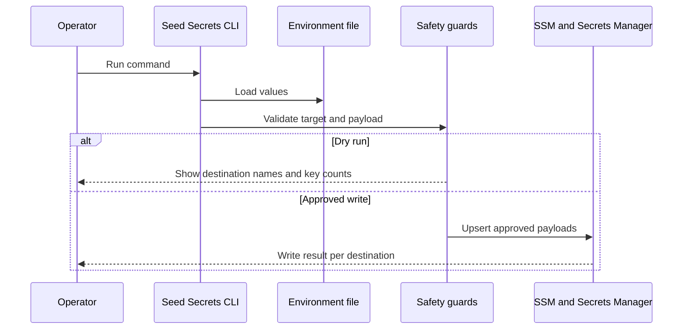

# Seeding flow

The command parses flags, loads an environment file, keeps only allowed nonempty
keys, groups them by destination, and then previews or writes those groups.

```mermaid
sequenceDiagram
    participant O as Operator
    participant CLI as Seed Secrets CLI
    participant E as Environment file
    participant G as Safety guards
    participant AWS as SSM and Secrets Manager

    O->>CLI: Run command
    CLI->>E: Load values
    CLI->>G: Validate target and payload
    alt Dry run
        G-->>O: Show destination names and key counts
    else Approved write
        G->>AWS: Upsert approved payloads
        AWS-->>O: Write result per destination
    end
```

The flow is implemented by [`main.py`](../../main.py), the CLI parser, and
`SeedUseCase`. Only known destinations may be selected with `--only`, and empty
values are skipped.

The tool may accept service-prefixed local aliases such as `USER_DATABASE_URL`
and map them to a canonical managed key. Alias handling is deliberately scoped
to the destination service to prevent a value for one service being used by
another.
