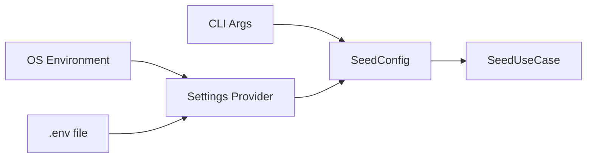

# Configuration

This document explains how to configure the Seed Secrets tool. Settings come from CLI arguments, environment variables, and a `.env` file.

## How Configuration Works



1. CLI arguments (`--endpoint-url`, `--region`, etc.) are parsed into a `SeedConfig`
2. The Settings provider loads from OS environment + `.env` file (via `python-dotenv`)
3. CLI arguments override Settings values
4. Empty strings are treated as `None` (so Docker Compose `${VAR:-}` passthrough works)

## Settings (Environment Variables)

These are read by the Settings provider from OS environment or `.env`:

| Variable | Type | Default | Description |
|----------|------|---------|-------------|
| `AWS_ENDPOINT_URL` | string | `None` (real AWS) | Floci: `http://localhost:4566`; real AWS: empty/omit |
| `AWS_REGION` | string | `ap-south-1` | AWS region for Secrets Manager |
| `ENV_FILE` | string | `infrastructure/docker/prod/.env` | Path to the dotenv file to read |

## CLI Arguments (Override Settings)

These override the corresponding settings:

| Argument | Overrides | Default | Description |
|----------|-----------|---------|-------------|
| `--endpoint-url` | `AWS_ENDPOINT_URL` | `None` | AWS endpoint URL |
| `--region` | `AWS_REGION` | `ap-south-1` | AWS region |
| `--env-file` | `ENV_FILE` | `infrastructure/docker/prod/.env` | Path to dotenv file |

**Precedence:** CLI argument > OS environment variable > `.env` file value

## Endpoint URL Behavior

| Value | Behavior |
|-------|----------|
| `http://localhost:4566` | Targets Floci/LocalStack (auto-injects `test/test` credentials) |
| `http://127.0.0.1:4566` | Same as above |
| `http://host.docker.internal:4566` | Same as above (Docker host) |
| Empty string (`""`) | Targets real AWS (IAM role or env credentials) |
| Omitted (`None`) | Targets real AWS |
| Any other URL | Custom endpoint (e.g., a proxy) |

## Environment Examples

### Local Development (Floci)

```bash
# Via CLI
python main.py \
  --env-file infrastructure/docker/prod/.env \
  --endpoint-url http://localhost:4566 \
  --region ap-south-1

# Via environment variables
export AWS_ENDPOINT_URL=http://localhost:4566
export AWS_REGION=ap-south-1
export ENV_FILE=infrastructure/docker/prod/.env
python main.py
```

### Real AWS (Production)

```bash
# Via CLI
python main.py \
  --env-file infrastructure/docker/prod/.env \
  --endpoint-url "" \
  --region ap-south-1 \
  --confirm-prod

# Via environment variables
export AWS_ENDPOINT_URL=
export AWS_REGION=ap-south-1
python main.py --confirm-prod
```

### Using the Tool's `.env` File

```bash
# tools/seed-secrets/.env
AWS_ENDPOINT_URL=http://localhost:4566
AWS_REGION=ap-south-1
ENV_FILE=infrastructure/docker/prod/.env
```

Then just run:

```bash
python main.py
```

## How the `.env` File Is Read

The tool uses a robust dotenv parser that handles:

| Format | Example | Handled? |
|--------|---------|----------|
| Plain key=value | `KEY=value` | Yes |
| `export` prefix | `export KEY=value` | Yes |
| Double-quoted value | `KEY="value"` | Yes |
| Single-quoted value | `KEY='value'` | Yes |
| Inline comment | `KEY=value # comment` | Yes |
| Comment inside quotes | `KEY="value # not a comment"` | Yes |
| Space before value | `KEY= value` | Yes |
| Empty value | `KEY=` | Ignored (not seeded) |

**Only keys in the allowlist are read.** Everything else (`DATABASE_URL`, `REDIS_URL`, `MONGO_URI`, etc.) is ignored.

## Floci Auto-Credentials

When targeting Floci/LocalStack (`localhost:4566`, `127.0.0.1:4566`, or `host.docker.internal:4566`), the tool automatically injects:

```python
aws_access_key_id = "test"
aws_secret_access_key = "test"
```

This only happens if `AWS_ACCESS_KEY_ID` is not already set in the environment.

## Settings Validation Errors

| Error Message | Cause | How to Fix |
|---------------|-------|------------|
| `env_file must be non-empty` | Empty `--env-file` or `ENV_FILE` | Set a valid file path |
| `env_file contains null byte` | Path has `\x00` | Use a clean path |
| `unknown secret <name>` | `--only` contains invalid name | Use a name from `APP_SECRETS` or `TF_MANAGED_SECRETS` |

## Viewing Current Configuration

The tool prints a banner before seeding:

```
target=Floci (http://localhost:4566) region=ap-south-1 env-file=/path/to/.env
```

For dry-run:

```
[dry-run] target=Floci (http://localhost:4566) region=ap-south-1 env-file=/path/to/.env
```

## Makefile Commands

### Root Makefile (from project root)

| Command | Description |
|---------|-------------|
| `make seed-install` | Install dependencies |
| `make seed-floci` | Seed to Floci from `SEED_FILE` |
| `make seed-floci-dry` | Preview seed to Floci |
| `make seed-aws` | Seed to real AWS (requires `--confirm-prod`) |
| `make seed-dry` | Preview against endpoint from `AWS_ENDPOINT_URL` |

### Per-Tool Makefile

| Command | Description |
|---------|-------------|
| `make install` | Install dependencies with Poetry |
| `make lint` | Run ruff linter |
| `make test` | Run unit tests (no network) |
| `make test-all` | Run all tests (unit + integration) |
| `make test-cov` | Run tests with coverage report (65% gate) |
| `make dry-run` | Floci dry-run |
| `make seed-floci` | Seed to Floci |
| `make clean` | Remove cache and coverage files |

## Troubleshooting

### "No allowlisted keys found"

The `.env` file doesn't contain keys the tool knows about. Ensure you're pointing to `infrastructure/docker/prod/.env` and it contains keys like `NEXTAUTH_SECRET`, `GOOGLE_ID`, etc.

### Settings not updating

Settings are cached in memory. If you change environment variables, restart the process. In tests, call `clear_settings_cache()` to reset.

### Empty strings ignored

If you set `AWS_ENDPOINT_URL=` (empty) in your `.env`, the tool treats it as `None` (real AWS). This is intentional so Docker Compose `${VAR:-}` passthrough doesn't break.

## Related Documentation

- [Quick Start](quickstart.md) - Get up and running
- [CLI Reference](../components/cli.md) - All command-line options
- [Architecture](../concepts/architecture.md) - How configuration fits in the system
- [Validation & Guards](../components/validation.md) - Safety guard rules
