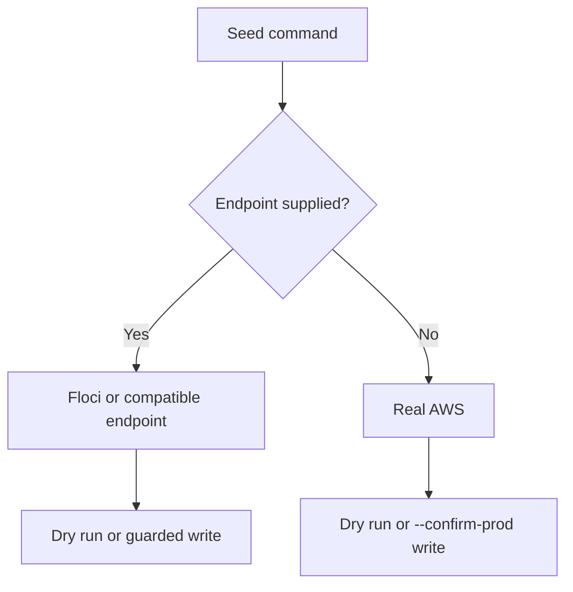

# Seed Secrets configuration

## Inputs

| Input | Default | Purpose |
| --- | --- | --- |
| `--env-file` | `infrastructure/docker/prod/.env` | Source environment file. |
| `--endpoint-url` | Environment `AWS_ENDPOINT_URL`, otherwise empty | AWS-compatible endpoint. Empty targets real AWS. |
| `--region` | `ap-south-1` | AWS region. |

The tool's optional `.env.example` supplies local defaults for its settings
provider. The environment file passed with `--env-file` is the file whose
approved application values are read.

## Floci versus real AWS

```mermaid
flowchart TD
    command[Seed command] --> endpoint{Endpoint supplied?}
    endpoint -->|Yes| floci[Floci or compatible endpoint]
    endpoint -->|No| aws[Real AWS]
    floci --> preview[Dry run or guarded write]
    aws --> confirm[Dry run or --confirm-prod write]
```

A real AWS write requires `--confirm-prod`. A real AWS dry run does not require
that confirmation because it makes no write.

## Root Makefile integration

`make prod-up SEED_SECRETS=1` invokes the tool before starting production
application containers. It intentionally does not seed by default, protecting
Terraform-managed real values from an accidental overwrite.
