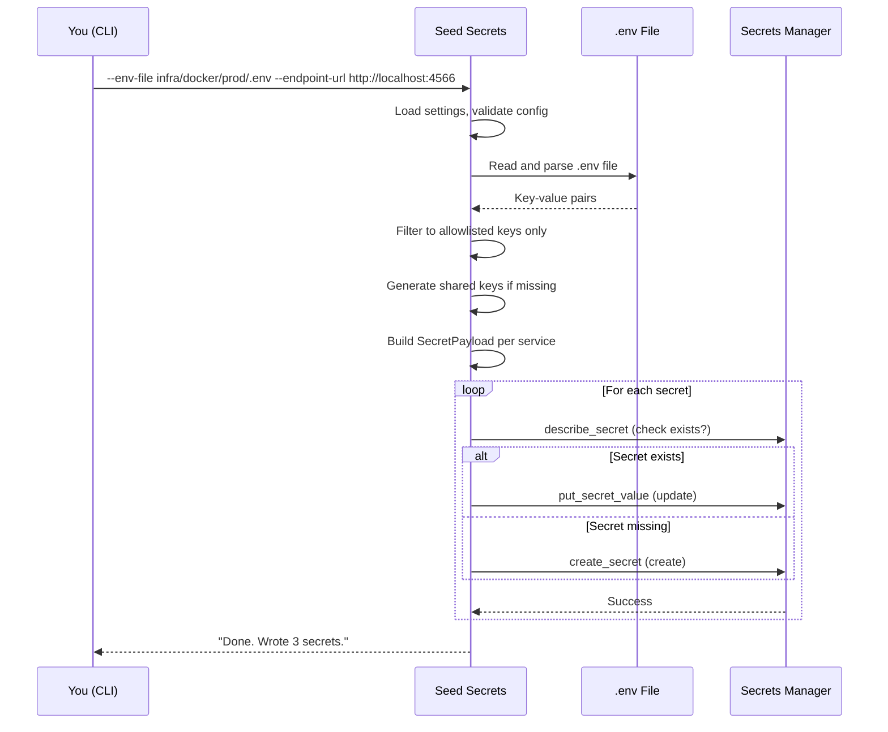

# Quick Start

This guide will help you seed your first secrets into AWS Secrets Manager (Floci/LocalStack) in under 5 minutes.

## Prerequisites

- **Python 3.11+** (check with `python --version`)
- **Poetry** (install from [python-poetry.org](https://python-poetry.org))
- **A `.env` file** with your app secrets (usually at `infra/docker/prod/.env`)
- **Floci/LocalStack** running (for local development) or AWS credentials (for production)

## Step 1: Install Dependencies

```bash
# From the project root
poetry -C tools/seed-secrets install

# Or using Make
make -C tools/seed-secrets install
```

## Step 2: Dry-Run (Preview)

Before writing anything, preview what would be seeded:

```bash
# From the project root — preview against Floci
poetry -C tools/seed-secrets run python main.py \
  --env-file infra/docker/prod/.env \
  --endpoint-url http://localhost:4566 \
  --dry-run

# Or using Make
make -C tools/seed-secrets dry-run
```

Expected output:

```
[dry-run] target=Floci (http://localhost:4566) region=ap-south-1 env-file=infra/docker/prod/.env
found 8 allowlisted keys in .env: GITHUB_ID, GITHUB_SECRET, GOOGLE_ID, ...
dry-run     detectai/web/secrets (8 keys)
dry-run     detectai/gateway/secrets (2 keys)
dry-run     detectai/inference/secrets (2 keys)
[dry-run] no secrets were written.
```

## Step 3: Seed to Floci (Local Development)

```bash
# Write secrets to Floci/LocalStack
poetry -C tools/seed-secrets run python main.py \
  --env-file infra/docker/prod/.env \
  --endpoint-url http://localhost:4566

# Or using Make
make -C tools/seed-secrets seed-floci
```

Expected output:

```
target=Floci (http://localhost:4566) region=ap-south-1 env-file=infra/docker/prod/.env
found 8 allowlisted keys in .env: GITHUB_ID, GITHUB_SECRET, GOOGLE_ID, ...
created    detectai/web/secrets (8 keys)
created    detectai/gateway/secrets (2 keys)
created    detectai/inference/secrets (2 keys)

Done. Wrote 3 secrets to Floci (http://localhost:4566).

Verify: aws --endpoint-url http://localhost:4566 --region ap-south-1 secretsmanager list-secrets --query 'SecretList[].Name'
```

## Step 4: Verify

```bash
# List all secrets in Floci
aws --endpoint-url http://localhost:4566 --region ap-south-1 \
  secretsmanager list-secrets --query 'SecretList[].Name'

# Check a specific secret
aws --endpoint-url http://localhost:4566 --region ap-south-1 \
  secretsmanager get-secret-value --secret-id detectai/web/secrets --query SecretString
```

## What Just Happened?



1. **Loaded settings** — Read `AWS_ENDPOINT_URL` and `AWS_REGION` from environment
2. **Parsed `.env`** — Read and parsed the dotenv file (handles `export`, quotes, comments)
3. **Filtered keys** — Only keys in the allowlist are considered (e.g., `DATABASE_URL` is ignored)
4. **Generated shared keys** — If `INTERNAL_API_KEY` or `AI_SERVICE_API_KEY` are missing, random values are generated and synced across services
5. **Built payloads** — Created a JSON blob for each service (web, gateway, workers, inference)
6. **Upserted to AWS** — For each payload: check if it exists, then create or update

## Seeding to Real AWS

For production, you need `--confirm-prod` as a safety guard:

```bash
poetry -C tools/seed-secrets run python main.py \
  --env-file infra/docker/prod/.env \
  --endpoint-url "" \
  --region ap-south-1 \
  --confirm-prod

# Or using Make
make -C tools/seed-secrets seed-aws
```

> **Safety:** The tool refuses to write to real AWS without `--confirm-prod` unless you use `--dry-run`. This prevents accidental production changes.

## Next Steps

- [Configuration](configuration.md) - Customize settings for your environment
- [CLI Reference](../components/cli.md) - All command-line options
- [Secrets Mapping](../components/secrets-mapping.md) - Which keys go where
- [Architecture](../concepts/architecture.md) - How the tool is built

## Troubleshooting

### "No allowlisted keys found in ..."

The `.env` file doesn't contain any keys the tool knows about. Make sure you're pointing to the right file (`infra/docker/prod/.env`) and that it contains keys like `NEXTAUTH_SECRET`, `GOOGLE_ID`, etc.

### "refusing to touch TF-managed secret ..."

You're trying to seed a Terraform-managed secret without `--force`. Use `--force` to override, or remove the secret name from `--only`.

### "refusing to write to real AWS without --confirm-prod"

You're targeting real AWS without the safety flag. Add `--confirm-prod` or use `--dry-run` to preview.

### "ERROR: Environment file not found"

The `.env` file doesn't exist at the specified path. Check `--env-file` or ensure the file exists at `infra/docker/prod/.env`.

### "Configuration error"

Check that your settings are valid. See [Configuration](configuration.md) for all options.

## Stopping / Cleanup

This tool runs once and exits. There's no process to stop. Secrets written to Floci are removed when LocalStack restarts. For real AWS, delete secrets via the AWS console or CLI.
